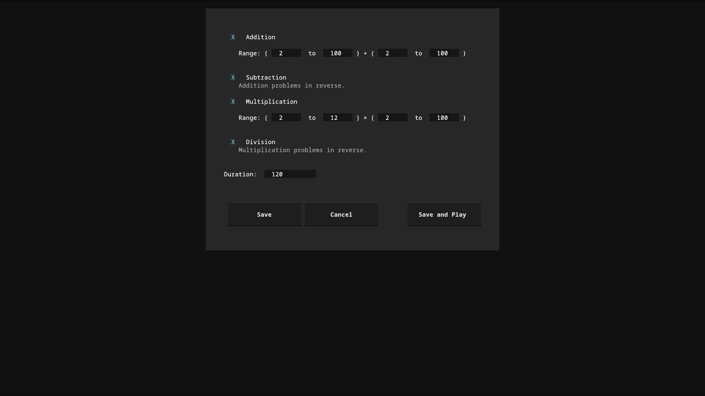
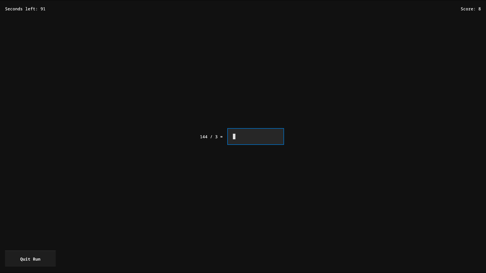

# zetamac-py

A terminal clone of [Zetamac](https://arithmetic.zetamac.com/), the timed mental-math arithmetic practice/quant trainer, built with [Textual](https://github.com/Textualize/textual).


## Screenshots



## Overview

zetamac-py provides the core Zetamac gameplay loop in a terminal user interface, with local run history and replay functionality:

- Runs are stored locally in a SQLite database
- Replay mode allows stepping through the problems from any past run
- Replay Hardest re-runs the personally hardest questions (took the longest), allowing for targetted improvement
- Per-run analytics show which operations and problems took longest
- Number ranges and enabled operations are configurable without query strings

## Features

- Timed rounds with configurable duration
- Addition, subtraction, multiplication, and division, individually toggleable
- Independently configurable number ranges for addition and multiplication problems
- Every run logged to a local SQLite database with per-problem timing
- Replay of any past run problem-by-problem, or direct replay of the hardest run
- Post-round and post-replay summaries with per-problem breakdown
- Keyboard-driven navigation (arrow keys / j-k, Enter to select, Esc/q to quit a round)
- Runs anywhere Python and a terminal are available; no browser required

## Installation

Requires Python 3.10+.

```bash
git clone https://github.com/yaofanfish/zetamac-py.git
cd zetamac-py
pip install -e .
```

Or install directly with `pip`:

```bash
pip install zetamac-py
```

*(Once published to PyPI — see [Roadmap](#roadmap).)*

## Usage

Launch the app:

```bash
zetamac-py
```

From the main menu:

| Item | Description |
|---|---|
| **Settings** | Enable/disable operations, set number ranges, set round duration |
| **Play** | Start a timed round |
| **Replay** | Browse recent runs and replay one problem-by-problem |
| **Replay Hardest** | Replay the highest-scoring run |
| **View Runs** | Browse run history and inspect raw run data |
| **Quit** | Exit the app |

During a round, type an answer and press Enter; correct answers advance to the next problem automatically. Press `q` or `Esc` at any time to end the round early.

## Configuration

Settings are stored at `~/.config/zetamac-py/settings.json` and can be edited through the in-app Settings screen or by hand. Run history is stored in a SQLite database at `~/.local/share/zetamac-py/runs.db`.

## Roadmap

- [ ] Publish to PyPI
- [ ] Configurable keybindings

Contributions toward any of the above, or other proposals, are welcome — see below.

## Contributing

Issues and pull requests are welcome. 

```bash
git clone https://github.com/yaofanfish/zetamac-py.git
cd zetamac-py
pip install -e ".[dev,opt]"
```

## License

[GPL-v3](LICENSE)

## Acknowledgments

- Inspired by [Zetamac](https://arithmetic.zetamac.com/) by Zach Wissner-Gross
- Built with [Textual](https://github.com/Textualize/textual) and [Rich](https://github.com/Textualize/rich)
